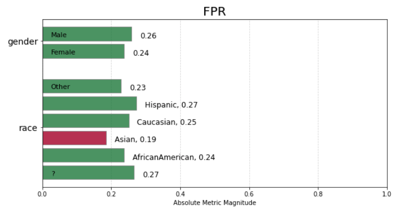

# Patient Selection for Diabetes Drug Testing

## Introduction 

EHR data is becoming a key source of real-world evidence (RWE) for the pharmaceutical industry and regulators to make decisions on clinical trials. In this project, we will create a deep learning model trained on EHR data (Electronic Health Records) to find suitable patients for testing a new diabetes drug.

Utilizing a synthetic dataset (denormalized at the line level augmentation) built off of the UCI Diabetes readmission dataset, we will build a regression model that predicts the expected days of hospitalization time and then convert this to a binary prediction of whether to include or exclude that patient from the clinical trial. This project will demonstrate the importance of building the right data representation at the encounter level, with appropriate filtering and preprocessing/feature engineering of key medical code sets. We will also analyze and interpret the model for biases across key demographic groups.

## The Dataset

Due to healthcare PHI regulations (HIPAA, HITECH), there are limited number of publicly available datasets and some datasets require training and approval. So, for this study, we are using a dataset from [UC Irvine](https://archive.ics.uci.edu/ml/datasets/Diabetes+130-US+hospitals+for+years+1999-2008) that has been modified.

## Key files

- [Notebook for data analysis and model development](https://github.com/pranath/patient_select_diabetes/blob/master/patient_select_diabetes.ipynb)

## Results

The final model achieved an F1 score of 0.54 and a ROC-AUC of 0.5.

In the fairness analysis of the model predictions, there appears to be signficant disparity with the Asian race being under-represented with a magnitude of 0.19.

#### Fairness Analysis - Relative to a Reference Group

