# Patient Selection for Diabetes Drug Testing

## Introduction

EHR data is becoming a key source of real-world evidence (RWE) for the pharmaceutical industry and regulators to [make decisions on clinical trials](https://www.fda.gov/news-events/speeches-fda-officials/breaking-down-barriers-between-clinical-trials-and-clinical-care-incorporating-real-world-evidence). 

For this project, we have a groundbreaking diabetes drug that is ready for clinical trial testing. It is a very unique and sensitive drug that requires administering the drug over at least 5-7 days of time in the hospital with frequent monitoring/testing and patient medication adherence training with a mobile application. We have been provided a patient dataset from a client partner and are tasked with building a predictive model that can identify which type of patients the company should focus their efforts testing this drug on. Target patients are people that are likely to be in the hospital for this duration of time and will not incur significant additional costs for administering this drug to the patient and monitoring.  

In order to achieve our goal we must build a regression model that can predict the estimated hospitalization time for a patient and use this to select/filter patients for this study.

## Approach ##

Utilizing a synthetic dataset (denormalized at the line level augmentation) built off of the UCI Diabetes readmission dataset, we will build a regression model that predicts the expected days of hospitalization time and then convert this to a binary prediction of whether to include or exclude that patient from the clinical trial.

This project will demonstrate the importance of building the right data representation at the encounter level, with appropriate filtering and preprocessing/feature engineering of key medical code sets. We will also analyze and interpret the model for biases across key demographic groups. 

## Dataset

Due to healthcare PHI regulations (HIPAA, HITECH), there are limited number of publicly available datasets and some datasets require training and approval. So, for the purpose of this study, we are using a dataset from [UC Irvine](https://archive.ics.uci.edu/ml/datasets/Diabetes+130-US+hospitals+for+years+1999-2008) that has been modified. 

## Load Libraries


```python
# from __future__ import absolute_import, division, print_function, unicode_literals
import os
import numpy as np
import seaborn as sns
import tensorflow as tf
from tensorflow.keras import layers
import tensorflow_probability as tfp
import matplotlib.pyplot as plt
import pandas as pd
from sklearn.metrics import accuracy_score, f1_score, classification_report, roc_auc_score
import aequitas as ae
import warnings
warnings.filterwarnings('ignore')
# Put all of the helper functions in utils
from utils import build_vocab_files, show_group_stats_viz, aggregate_dataset, preprocess_df, df_to_dataset, posterior_mean_field, prior_trainable
pd.set_option('display.max_columns', 500)
# this allows you to make changes and save in student_utils.py and the file is reloaded every time you run a code block
%load_ext autoreload
%autoreload
```

    The autoreload extension is already loaded. To reload it, use:
      %reload_ext autoreload


```python
#OPEN ISSUE ON MAC OSX for TF model training
import os
os.environ['KMP_DUPLICATE_LIB_OK']='True'
```

## 1. Dataset Loading and Schema Review


```python
dataset_path = "./data/final_project_dataset.csv"
df = pd.read_csv(dataset_path)
```


```python
# Show first few rows
df.head()
```


<div>
<table border="1" class="dataframe">
  <thead>
    <tr style="text-align: right;">
      <th></th>
      <th>encounter_id</th>
      <th>patient_nbr</th>
      <th>race</th>
      <th>gender</th>
      <th>age</th>
      <th>weight</th>
      <th>admission_type_id</th>
      <th>discharge_disposition_id</th>
      <th>admission_source_id</th>
      <th>time_in_hospital</th>
      <th>payer_code</th>
      <th>medical_specialty</th>
      <th>primary_diagnosis_code</th>
      <th>other_diagnosis_codes</th>
      <th>number_outpatient</th>
      <th>number_inpatient</th>
      <th>number_emergency</th>
      <th>num_lab_procedures</th>
      <th>number_diagnoses</th>
      <th>num_medications</th>
      <th>num_procedures</th>
      <th>ndc_code</th>
      <th>max_glu_serum</th>
      <th>A1Cresult</th>
      <th>change</th>
      <th>readmitted</th>
    </tr>
  </thead>
  <tbody>
    <tr>
      <th>0</th>
      <td>2278392</td>
      <td>8222157</td>
      <td>Caucasian</td>
      <td>Female</td>
      <td>[0-10)</td>
      <td>?</td>
      <td>6</td>
      <td>25</td>
      <td>1</td>
      <td>1</td>
      <td>?</td>
      <td>Pediatrics-Endocrinology</td>
      <td>250.83</td>
      <td>?|?</td>
      <td>0</td>
      <td>0</td>
      <td>0</td>
      <td>41</td>
      <td>1</td>
      <td>1</td>
      <td>0</td>
      <td>NaN</td>
      <td>None</td>
      <td>None</td>
      <td>No</td>
      <td>NO</td>
    </tr>
    <tr>
      <th>1</th>
      <td>149190</td>
      <td>55629189</td>
      <td>Caucasian</td>
      <td>Female</td>
      <td>[10-20)</td>
      <td>?</td>
      <td>1</td>
      <td>1</td>
      <td>7</td>
      <td>3</td>
      <td>?</td>
      <td>?</td>
      <td>276</td>
      <td>250.01|255</td>
      <td>0</td>
      <td>0</td>
      <td>0</td>
      <td>59</td>
      <td>9</td>
      <td>18</td>
      <td>0</td>
      <td>68071-1701</td>
      <td>None</td>
      <td>None</td>
      <td>Ch</td>
      <td>&gt;30</td>
    </tr>
    <tr>
      <th>2</th>
      <td>64410</td>
      <td>86047875</td>
      <td>AfricanAmerican</td>
      <td>Female</td>
      <td>[20-30)</td>
      <td>?</td>
      <td>1</td>
      <td>1</td>
      <td>7</td>
      <td>2</td>
      <td>?</td>
      <td>?</td>
      <td>648</td>
      <td>250|V27</td>
      <td>2</td>
      <td>1</td>
      <td>0</td>
      <td>11</td>
      <td>6</td>
      <td>13</td>
      <td>5</td>
      <td>0378-1110</td>
      <td>None</td>
      <td>None</td>
      <td>No</td>
      <td>NO</td>
    </tr>
    <tr>
      <th>3</th>
      <td>500364</td>
      <td>82442376</td>
      <td>Caucasian</td>
      <td>Male</td>
      <td>[30-40)</td>
      <td>?</td>
      <td>1</td>
      <td>1</td>
      <td>7</td>
      <td>2</td>
      <td>?</td>
      <td>?</td>
      <td>8</td>
      <td>250.43|403</td>
      <td>0</td>
      <td>0</td>
      <td>0</td>
      <td>44</td>
      <td>7</td>
      <td>16</td>
      <td>1</td>
      <td>68071-1701</td>
      <td>None</td>
      <td>None</td>
      <td>Ch</td>
      <td>NO</td>
    </tr>
    <tr>
      <th>4</th>
      <td>16680</td>
      <td>42519267</td>
      <td>Caucasian</td>
      <td>Male</td>
      <td>[40-50)</td>
      <td>?</td>
      <td>1</td>
      <td>1</td>
      <td>7</td>
      <td>1</td>
      <td>?</td>
      <td>?</td>
      <td>197</td>
      <td>157|250</td>
      <td>0</td>
      <td>0</td>
      <td>0</td>
      <td>51</td>
      <td>5</td>
      <td>8</td>
      <td>0</td>
      <td>0049-4110</td>
      <td>None</td>
      <td>None</td>
      <td>Ch</td>
      <td>NO</td>
    </tr>
  </tbody>
</table>
</div>


```python
# See how many null values
df.info()
```

    <class 'pandas.core.frame.DataFrame'>
    RangeIndex: 143424 entries, 0 to 143423
    Data columns (total 26 columns):
     #   Column                    Non-Null Count   Dtype 
    ---  ------                    --------------   ----- 
     0   encounter_id              143424 non-null  int64 
     1   patient_nbr               143424 non-null  int64 
     2   race                      143424 non-null  object
     3   gender                    143424 non-null  object
     4   age                       143424 non-null  object
     5   weight                    143424 non-null  object
     6   admission_type_id         143424 non-null  int64 
     7   discharge_disposition_id  143424 non-null  int64 
     8   admission_source_id       143424 non-null  int64 
     9   time_in_hospital          143424 non-null  int64 
     10  payer_code                143424 non-null  object
     11  medical_specialty         143424 non-null  object
     12  primary_diagnosis_code    143424 non-null  object
     13  other_diagnosis_codes     143424 non-null  object
     14  number_outpatient         143424 non-null  int64 
     15  number_inpatient          143424 non-null  int64 
     16  number_emergency          143424 non-null  int64 
     17  num_lab_procedures        143424 non-null  int64 
     18  number_diagnoses          143424 non-null  int64 
     19  num_medications           143424 non-null  int64 
     20  num_procedures            143424 non-null  int64 
     21  ndc_code                  119962 non-null  object
     22  max_glu_serum             143424 non-null  object
     23  A1Cresult                 143424 non-null  object
     24  change                    143424 non-null  object
     25  readmitted                143424 non-null  object
    dtypes: int64(13), object(13)
    memory usage: 28.5+ MB


```python
# Get number of rows
df.shape
```


    (143424, 26)


```python
# Get number of unique encounter id's
df['encounter_id'].nunique()
```


    101766


### Determine Level of Dataset (Line or Encounter)

Given there are only 101766 unique encounter_id's yet there are 143424 rows that are not nulls, this looks like the dataset is at the line level.

We would also want to aggregate on the primary_diagnosis_code as there is also only one of these per encounter. By aggregating on these 3 columns, we can create a encounter level dataset.

## 2. Analyze Dataset


```python
# See how many null values
df.info()
```

    <class 'pandas.core.frame.DataFrame'>
    RangeIndex: 143424 entries, 0 to 143423
    Data columns (total 26 columns):
     #   Column                    Non-Null Count   Dtype 
    ---  ------                    --------------   ----- 
     0   encounter_id              143424 non-null  int64 
     1   patient_nbr               143424 non-null  int64 
     2   race                      143424 non-null  object
     3   gender                    143424 non-null  object
     4   age                       143424 non-null  object
     5   weight                    143424 non-null  object
     6   admission_type_id         143424 non-null  int64 
     7   discharge_disposition_id  143424 non-null  int64 
     8   admission_source_id       143424 non-null  int64 
     9   time_in_hospital          143424 non-null  int64 
     10  payer_code                143424 non-null  object
     11  medical_specialty         143424 non-null  object
     12  primary_diagnosis_code    143424 non-null  object
     13  other_diagnosis_codes     143424 non-null  object
     14  number_outpatient         143424 non-null  int64 
     15  number_inpatient          143424 non-null  int64 
     16  number_emergency          143424 non-null  int64 
     17  num_lab_procedures        143424 non-null  int64 
     18  number_diagnoses          143424 non-null  int64 
     19  num_medications           143424 non-null  int64 
     20  num_procedures            143424 non-null  int64 
     21  ndc_code                  119962 non-null  object
     22  max_glu_serum             143424 non-null  object
     23  A1Cresult                 143424 non-null  object
     24  change                    143424 non-null  object
     25  readmitted                143424 non-null  object
    dtypes: int64(13), object(13)
    memory usage: 28.5+ MB


```python
# Look at range of values & key stats for numerical columns
numerical_feature_list = ['time_in_hospital',  'number_outpatient', 'number_inpatient', 'number_emergency', 'num_lab_procedures', 'number_diagnoses', 'num_medications', 'num_procedures' ]
df[numerical_feature_list].describe()
```


<div>
<table border="1" class="dataframe">
  <thead>
    <tr style="text-align: right;">
      <th></th>
      <th>time_in_hospital</th>
      <th>number_outpatient</th>
      <th>number_inpatient</th>
      <th>number_emergency</th>
      <th>num_lab_procedures</th>
      <th>number_diagnoses</th>
      <th>num_medications</th>
      <th>num_procedures</th>
    </tr>
  </thead>
  <tbody>
    <tr>
      <th>count</th>
      <td>143424.000000</td>
      <td>143424.000000</td>
      <td>143424.000000</td>
      <td>143424.000000</td>
      <td>143424.000000</td>
      <td>143424.000000</td>
      <td>143424.000000</td>
      <td>143424.000000</td>
    </tr>
    <tr>
      <th>mean</th>
      <td>4.490190</td>
      <td>0.362429</td>
      <td>0.600855</td>
      <td>0.195086</td>
      <td>43.255745</td>
      <td>7.424434</td>
      <td>16.776035</td>
      <td>1.349021</td>
    </tr>
    <tr>
      <th>std</th>
      <td>2.999667</td>
      <td>1.249295</td>
      <td>1.207934</td>
      <td>0.920410</td>
      <td>19.657319</td>
      <td>1.924872</td>
      <td>8.397130</td>
      <td>1.719104</td>
    </tr>
    <tr>
      <th>min</th>
      <td>1.000000</td>
      <td>0.000000</td>
      <td>0.000000</td>
      <td>0.000000</td>
      <td>1.000000</td>
      <td>1.000000</td>
      <td>1.000000</td>
      <td>0.000000</td>
    </tr>
    <tr>
      <th>25%</th>
      <td>2.000000</td>
      <td>0.000000</td>
      <td>0.000000</td>
      <td>0.000000</td>
      <td>32.000000</td>
      <td>6.000000</td>
      <td>11.000000</td>
      <td>0.000000</td>
    </tr>
    <tr>
      <th>50%</th>
      <td>4.000000</td>
      <td>0.000000</td>
      <td>0.000000</td>
      <td>0.000000</td>
      <td>44.000000</td>
      <td>8.000000</td>
      <td>15.000000</td>
      <td>1.000000</td>
    </tr>
    <tr>
      <th>75%</th>
      <td>6.000000</td>
      <td>0.000000</td>
      <td>1.000000</td>
      <td>0.000000</td>
      <td>57.000000</td>
      <td>9.000000</td>
      <td>21.000000</td>
      <td>2.000000</td>
    </tr>
    <tr>
      <th>max</th>
      <td>14.000000</td>
      <td>42.000000</td>
      <td>21.000000</td>
      <td>76.000000</td>
      <td>132.000000</td>
      <td>16.000000</td>
      <td>81.000000</td>
      <td>6.000000</td>
    </tr>
  </tbody>
</table>
</div>


```python
# Plot histograms to show distributions for numerical fields
df.hist(figsize=(20,10))
```


    array([[<matplotlib.axes._subplots.AxesSubplot object at 0x7f5240018bd0>,
            <matplotlib.axes._subplots.AxesSubplot object at 0x7f5240049450>,
            <matplotlib.axes._subplots.AxesSubplot object at 0x7f52187d4d90>,
            <matplotlib.axes._subplots.AxesSubplot object at 0x7f521879c450>],
           [<matplotlib.axes._subplots.AxesSubplot object at 0x7f52187519d0>,
            <matplotlib.axes._subplots.AxesSubplot object at 0x7f5218707f50>,
            <matplotlib.axes._subplots.AxesSubplot object at 0x7f5290606ed0>,
            <matplotlib.axes._subplots.AxesSubplot object at 0x7f52906030d0>],
           [<matplotlib.axes._subplots.AxesSubplot object at 0x7f52906033d0>,
            <matplotlib.axes._subplots.AxesSubplot object at 0x7f524031d990>,
            <matplotlib.axes._subplots.AxesSubplot object at 0x7f5240385990>,
            <matplotlib.axes._subplots.AxesSubplot object at 0x7f529059a910>],
           [<matplotlib.axes._subplots.AxesSubplot object at 0x7f52905c9b90>,
            <matplotlib.axes._subplots.AxesSubplot object at 0x7f5292fd4450>,
            <matplotlib.axes._subplots.AxesSubplot object at 0x7f5292f60c50>,
            <matplotlib.axes._subplots.AxesSubplot object at 0x7f52403ac590>]],
          dtype=object)


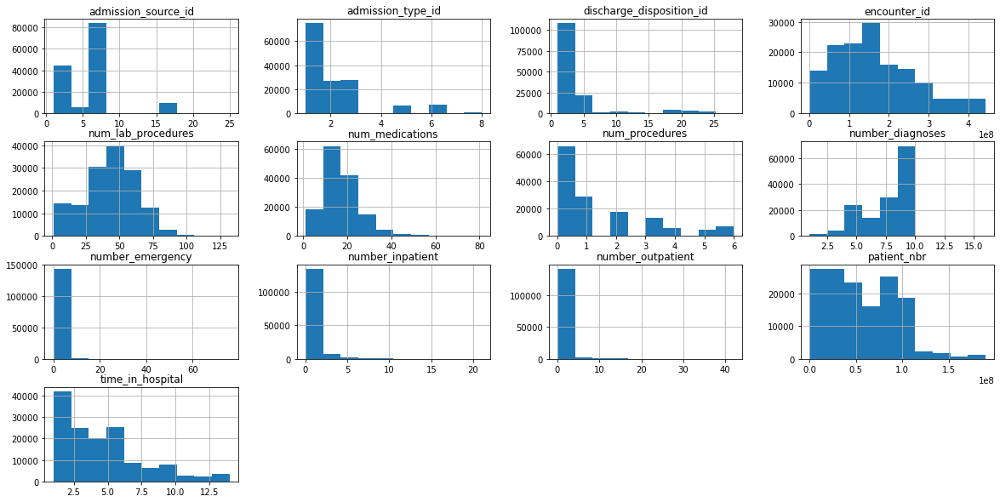


```python
# Define utility functions
def create_cardinality_feature(df):
    num_rows = len(df)
    random_code_list = np.arange(100, 1000, 1)
    return np.random.choice(random_code_list, num_rows)
    
def count_unique_values(df, cat_col_list):
    cat_df = df[cat_col_list]
    cat_df['principal_diagnosis_code'] = create_cardinality_feature(cat_df)
    #add feature with high cardinality
    val_df = pd.DataFrame({'columns': cat_df.columns, 
                       'cardinality': cat_df.nunique() } )
    return val_df

categorical_feature_list = [ 'race', 'gender', 'age', 'weight', 'payer_code', 'medical_specialty', 'primary_diagnosis_code', 'other_diagnosis_codes','ndc_code', 'max_glu_serum', 'A1Cresult', 'change', 'readmitted']

categorical_df = count_unique_values(df, categorical_feature_list) 
categorical_df
```


<div>
<table border="1" class="dataframe">
  <thead>
    <tr style="text-align: right;">
      <th></th>
      <th>columns</th>
      <th>cardinality</th>
    </tr>
  </thead>
  <tbody>
    <tr>
      <th>race</th>
      <td>race</td>
      <td>6</td>
    </tr>
    <tr>
      <th>gender</th>
      <td>gender</td>
      <td>3</td>
    </tr>
    <tr>
      <th>age</th>
      <td>age</td>
      <td>10</td>
    </tr>
    <tr>
      <th>weight</th>
      <td>weight</td>
      <td>10</td>
    </tr>
    <tr>
      <th>payer_code</th>
      <td>payer_code</td>
      <td>18</td>
    </tr>
    <tr>
      <th>medical_specialty</th>
      <td>medical_specialty</td>
      <td>73</td>
    </tr>
    <tr>
      <th>primary_diagnosis_code</th>
      <td>primary_diagnosis_code</td>
      <td>717</td>
    </tr>
    <tr>
      <th>other_diagnosis_codes</th>
      <td>other_diagnosis_codes</td>
      <td>19374</td>
    </tr>
    <tr>
      <th>ndc_code</th>
      <td>ndc_code</td>
      <td>251</td>
    </tr>
    <tr>
      <th>max_glu_serum</th>
      <td>max_glu_serum</td>
      <td>4</td>
    </tr>
    <tr>
      <th>A1Cresult</th>
      <td>A1Cresult</td>
      <td>4</td>
    </tr>
    <tr>
      <th>change</th>
      <td>change</td>
      <td>2</td>
    </tr>
    <tr>
      <th>readmitted</th>
      <td>readmitted</td>
      <td>3</td>
    </tr>
    <tr>
      <th>principal_diagnosis_code</th>
      <td>principal_diagnosis_code</td>
      <td>900</td>
    </tr>
  </tbody>
</table>
</div>


```python
# Show unique values for fields of particular interest i.e. why 3 genders?
print(df['race'].unique())
print(df['age'].unique())
print(df['gender'].unique())
print(df['A1Cresult'].unique())
print(df['readmitted'].unique())
print(df['payer_code'].unique())
print(df['weight'].unique())
```

    ['Caucasian' 'AfricanAmerican' '?' 'Other' 'Asian' 'Hispanic']
    ['[0-10)' '[10-20)' '[20-30)' '[30-40)' '[40-50)' '[50-60)' '[60-70)'
     '[70-80)' '[80-90)' '[90-100)']
    ['Female' 'Male' 'Unknown/Invalid']
    ['None' '>7' '>8' 'Norm']
    ['NO' '>30' '<30']
    ['?' 'MC' 'MD' 'HM' 'UN' 'BC' 'SP' 'CP' 'SI' 'DM' 'CM' 'CH' 'PO' 'WC' 'OT'
     'OG' 'MP' 'FR']
    ['?' '[75-100)' '[50-75)' '[0-25)' '[100-125)' '[25-50)' '[125-150)'
     '[175-200)' '[150-175)' '>200']


```python
# Look at distribution for ages
ax = sns.countplot(x="age", data=df)
```


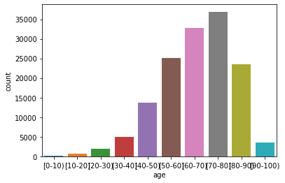


```python
# Look at distribution for gender
ax = sns.countplot(x="gender", data=df)
```


### Analysis key findings

- The ndc_code field has a high amount of missing values (23460)
- num_lab_procedures and num_medications seem to have a roughly normal distribution
- Fields that have a high cardinality are - medical_specialty, primary_diagnosis_code, other_diagnosis_codes, ndc_code, and principal_diagnosis_code. This is because there are many thousands of these codes that correspond to the many disease and diagnosis sub-classes that exist in the medical field.
- The distribution for the age field is approximately normal, which we would expect. The distribution for the gender field is roughly uniform & equal. In this case we discount the very small number of Unknown/valid cases. Again this is not surprising, as the distribution of genders in the general population is also roughly equal so this seems to be a representitive sample from the general population.

## 3. Reduce Dimensionality of the NDC Code Feature

NDC codes are a common format to represent the wide variety of drugs that are prescribed for patient care in the United States. The challenge is that there are many codes that map to the same or similar drug. We are provided with the ndc drug lookup file https://github.com/udacity/nd320-c1-emr-data-starter/blob/master/project/data_schema_references/ndc_lookup_table.csv derived from the National Drug Codes List site(https://ndclist.com/). 

We can use this file to come up with a way to reduce the dimensionality of this field and create a new field in the dataset called "generic_drug_name" in the output dataframe. 


```python
#NDC code lookup file
ndc_code_path = "./medication_lookup_tables/final_ndc_lookup_table"
ndc_code_df = pd.read_csv(ndc_code_path)
```


```python
# Check first new rows
ndc_code_df.head()
```


<div>
<table border="1" class="dataframe">
  <thead>
    <tr style="text-align: right;">
      <th></th>
      <th>NDC_Code</th>
      <th>Proprietary Name</th>
      <th>Non-proprietary Name</th>
      <th>Dosage Form</th>
      <th>Route Name</th>
      <th>Company Name</th>
      <th>Product Type</th>
    </tr>
  </thead>
  <tbody>
    <tr>
      <th>0</th>
      <td>0087-6060</td>
      <td>Glucophage</td>
      <td>Metformin Hydrochloride</td>
      <td>Tablet, Film Coated</td>
      <td>Oral</td>
      <td>Bristol-myers Squibb Company</td>
      <td>Human Prescription Drug</td>
    </tr>
    <tr>
      <th>1</th>
      <td>0087-6063</td>
      <td>Glucophage XR</td>
      <td>Metformin Hydrochloride</td>
      <td>Tablet, Extended Release</td>
      <td>Oral</td>
      <td>Bristol-myers Squibb Company</td>
      <td>Human Prescription Drug</td>
    </tr>
    <tr>
      <th>2</th>
      <td>0087-6064</td>
      <td>Glucophage XR</td>
      <td>Metformin Hydrochloride</td>
      <td>Tablet, Extended Release</td>
      <td>Oral</td>
      <td>Bristol-myers Squibb Company</td>
      <td>Human Prescription Drug</td>
    </tr>
    <tr>
      <th>3</th>
      <td>0087-6070</td>
      <td>Glucophage</td>
      <td>Metformin Hydrochloride</td>
      <td>Tablet, Film Coated</td>
      <td>Oral</td>
      <td>Bristol-myers Squibb Company</td>
      <td>Human Prescription Drug</td>
    </tr>
    <tr>
      <th>4</th>
      <td>0087-6071</td>
      <td>Glucophage</td>
      <td>Metformin Hydrochloride</td>
      <td>Tablet, Film Coated</td>
      <td>Oral</td>
      <td>Bristol-myers Squibb Company</td>
      <td>Human Prescription Drug</td>
    </tr>
  </tbody>
</table>
</div>


```python
# Check for duplicate NDC_Code's
ndc_code_df[ndc_code_df.duplicated(subset=['NDC_Code'])]
```


<div>
<table border="1" class="dataframe">
  <thead>
    <tr style="text-align: right;">
      <th></th>
      <th>NDC_Code</th>
      <th>Proprietary Name</th>
      <th>Non-proprietary Name</th>
      <th>Dosage Form</th>
      <th>Route Name</th>
      <th>Company Name</th>
      <th>Product Type</th>
    </tr>
  </thead>
  <tbody>
    <tr>
      <th>263</th>
      <td>0781-5634</td>
      <td>Pioglitazone Hydrochloride And Glimepiride</td>
      <td>Pioglitazone Hydrochloride And Glimepiride</td>
      <td>Tablet</td>
      <td>Oral</td>
      <td>Sandoz Inc</td>
      <td>Human Prescription Drug</td>
    </tr>
    <tr>
      <th>264</th>
      <td>0781-5635</td>
      <td>Pioglitazone Hydrochloride And Glimepiride</td>
      <td>Pioglitazone Hydrochloride And Glimepiride</td>
      <td>Tablet</td>
      <td>Oral</td>
      <td>Sandoz Inc</td>
      <td>Human Prescription Drug</td>
    </tr>
  </tbody>
</table>
</div>


```python
# Remove duplicates
ndc_code_df = ndc_code_df.drop(ndc_code_df.index[[263,264]])
ndc_code_df[ndc_code_df.duplicated(subset=['NDC_Code'])]
```


<div>
<table border="1" class="dataframe">
  <thead>
    <tr style="text-align: right;">
      <th></th>
      <th>NDC_Code</th>
      <th>Proprietary Name</th>
      <th>Non-proprietary Name</th>
      <th>Dosage Form</th>
      <th>Route Name</th>
      <th>Company Name</th>
      <th>Product Type</th>
    </tr>
  </thead>
  <tbody>
  </tbody>
</table>
</div>


```python
from student_utils import reduce_dimension_ndc
```


```python
reduce_dim_df = reduce_dimension_ndc(df, ndc_code_df)
```


```python
# Number of unique values should be less for the new output field
assert df['ndc_code'].nunique() > reduce_dim_df['generic_drug_name'].nunique()
```

## 4. Select First Encounter for each Patient 

In order to simplify the aggregation of data for the model, we will only select the first encounter for each patient in the dataset. This is to reduce the risk of data leakage of future patient encounters and to reduce complexity of the data transformation and modeling steps. We will assume that sorting in numerical order on the encounter_id provides the time horizon for determining which encounters come before and after another.


```python
from student_utils import select_first_encounter
first_encounter_df = select_first_encounter(reduce_dim_df)
```


```python
# unique patients in transformed dataset
unique_patients = first_encounter_df['patient_nbr'].nunique()
print("Number of unique patients:{}".format(unique_patients))

# unique encounters in transformed dataset
unique_encounters = first_encounter_df['encounter_id'].nunique()
print("Number of unique encounters:{}".format(unique_encounters))

original_unique_patient_number = reduce_dim_df['patient_nbr'].nunique()
# number of unique patients should be equal to the number of unique encounters and patients in the final dataset
assert original_unique_patient_number == unique_patients
assert original_unique_patient_number == unique_encounters
print("Tests passed!!")
```

    Number of unique patients:71518
    Number of unique encounters:71518
    Tests passed!!


## 5. Aggregate Dataset to Right Level for Modeling 

To make it simpler, we are creating dummy columns for each unique generic drug name and adding those are input features to the model. 


```python
exclusion_list = ['generic_drug_name']
grouping_field_list = [c for c in first_encounter_df.columns if c not in exclusion_list]
agg_drug_df, ndc_col_list = aggregate_dataset(first_encounter_df, grouping_field_list, 'generic_drug_name')
```


```python
assert len(agg_drug_df) == agg_drug_df['patient_nbr'].nunique() == agg_drug_df['encounter_id'].nunique()
```

## 6. Prepare Fields and Cast Dataset 

### Feature Selection


```python
# Look at counts for payer_code categories
ax = sns.countplot(x="payer_code", data=agg_drug_df)
```


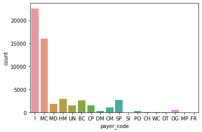


```python
# Look at counts for weight categories
ax = sns.countplot(x="weight", data=agg_drug_df)
```


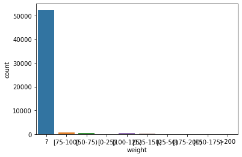


From the category counts above, we can see that for payer_code while there are many unknown values i.e. '?', there are still many values for other payer codes, these may prove useful predictors for our target variable. For weight, there are so few unknown '?' codes, that this feature is likely to be not very helpful for predicting our target variable.


```python
# Selected features
required_demo_col_list = ['race', 'gender', 'age']
student_categorical_col_list = [ "change", "readmitted", "payer_code", "medical_specialty", "primary_diagnosis_code", "other_diagnosis_codes", "max_glu_serum", "A1Cresult",  "admission_type_id", "discharge_disposition_id", "admission_source_id"] + required_demo_col_list + ndc_col_list
student_numerical_col_list = ["number_outpatient", "number_inpatient", "number_emergency", "num_lab_procedures", "number_diagnoses", "num_medications", "num_procedures"]
PREDICTOR_FIELD = 'time_in_hospital'
```


```python
def select_model_features(df, categorical_col_list, numerical_col_list, PREDICTOR_FIELD, grouping_key='patient_nbr'):
    selected_col_list = [grouping_key] + [PREDICTOR_FIELD] + categorical_col_list + numerical_col_list   
    return agg_drug_df[selected_col_list]

```


```python
selected_features_df = select_model_features(agg_drug_df, student_categorical_col_list, student_numerical_col_list,
                                            PREDICTOR_FIELD)
```

### Preprocess Dataset - Casting and Imputing  

We will cast and impute the dataset before splitting so that we do not have to repeat these steps across the splits in the next step. For imputing, there can be deeper analysis into which features to impute and how to impute but for the sake of time, we are taking a general strategy of imputing zero for only numerical features. 


```python
processed_df = preprocess_df(selected_features_df, student_categorical_col_list, 
        student_numerical_col_list, PREDICTOR_FIELD, categorical_impute_value='nan', numerical_impute_value=0)
```

## 7. Split Dataset into Train, Validation, and Test Partitions

In order to prepare the data for being trained and evaluated by a deep learning model, we will split the dataset into three partitions, with the validation partition used for optimizing the model hyperparameters during training. One of the key parts is that we need to be sure that the data does not accidently leak across partitions.

We will split the input dataset into three partitions(train, validation, test) with the following requirements:

- Approximately 60%/20%/20%  train/validation/test split
- Randomly sample different patients into each data partition
- We need to take care that a patient's data is not in more than one partition, so that we can avoid possible data leakage.
- We need to take care the total number of unique patients across the splits is equal to the total number of unique patients in the original dataset
- Total number of rows in original dataset = sum of rows across all three dataset partitions


```python
from student_utils import patient_dataset_splitter
d_train, d_val, d_test = patient_dataset_splitter(processed_df, 'patient_nbr')
```

    Total number of unique patients in train =  32563
    Total number of unique patients in validation =  10854
    Total number of unique patients in test =  10854
    Training partition has a shape =  (32563, 43)
    Validation partition has a shape =  (10854, 43)
    Test partition has a shape =  (10854, 43)


```python
assert len(d_train) + len(d_val) + len(d_test) == len(processed_df)
print("Test passed for number of total rows equal!")
```

    Test passed for number of total rows equal!


```python
assert (d_train['patient_nbr'].nunique() + d_val['patient_nbr'].nunique() + d_test['patient_nbr'].nunique()) == agg_drug_df['patient_nbr'].nunique()
print("Test passed for number of unique patients being equal!")
```

    Test passed for number of unique patients being equal!


## 8. Demographic Representation Analysis of Split

After the split, we should check to see the distribution of key features/groups and make sure that there is representative samples across the partitions. 

### Label Distribution Across Partitions

Are the histogram distribution shapes similar across partitions?


```python
show_group_stats_viz(processed_df, PREDICTOR_FIELD)
```

    time_in_hospital
    1.0     7318
    2.0     9191
    3.0     9740
    4.0     7417
    5.0     5348
    6.0     3991
    7.0     3123
    8.0     2311
    9.0     1597
    10.0    1241
    11.0    1008
    12.0     783
    13.0     663
    14.0     540
    dtype: int64
    AxesSubplot(0.125,0.125;0.775x0.755)


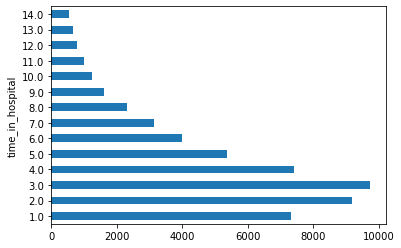


```python
show_group_stats_viz(d_train, PREDICTOR_FIELD)
```

    time_in_hospital
    1.0     4392
    2.0     5476
    3.0     5921
    4.0     4386
    5.0     3267
    6.0     2408
    7.0     1861
    8.0     1359
    9.0      945
    10.0     745
    11.0     616
    12.0     470
    13.0     404
    14.0     313
    dtype: int64
    AxesSubplot(0.125,0.125;0.775x0.755)


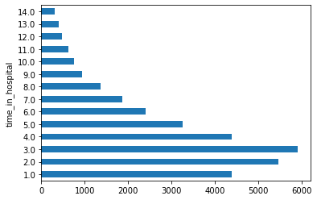


```python
show_group_stats_viz(d_test, PREDICTOR_FIELD)
```

    time_in_hospital
    1.0     1478
    2.0     1819
    3.0     1909
    4.0     1519
    5.0     1027
    6.0      780
    7.0      653
    8.0      490
    9.0      325
    10.0     237
    11.0     205
    12.0     161
    13.0     139
    14.0     112
    dtype: int64
    AxesSubplot(0.125,0.125;0.775x0.755)


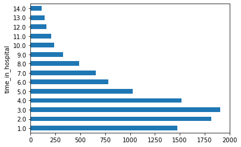


### Demographic Group Analysis

We should check that our partitions/splits of the dataset are similar in terms of their demographic profiles. 


```python
# Full dataset before splitting
patient_demo_features = ['race', 'gender', 'age', 'patient_nbr']
patient_group_analysis_df = processed_df[patient_demo_features].groupby('patient_nbr').head(1).reset_index(drop=True)
show_group_stats_viz(patient_group_analysis_df, 'gender')
```

    gender
    Female             28572
    Male               25697
    Unknown/Invalid        2
    dtype: int64
    AxesSubplot(0.125,0.125;0.775x0.755)


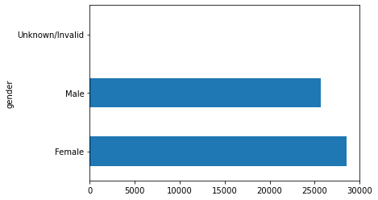


```python
# Training partition
show_group_stats_viz(d_train, 'gender')
```

    gender
    Female             17218
    Male               15344
    Unknown/Invalid        1
    dtype: int64
    AxesSubplot(0.125,0.125;0.775x0.755)


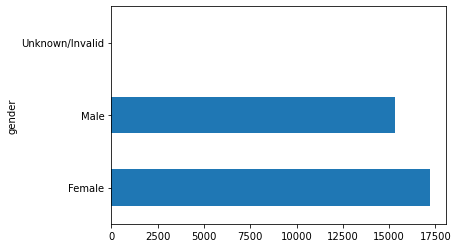


```python
# Test partition
show_group_stats_viz(d_test, 'gender')
```

    gender
    Female    5719
    Male      5135
    dtype: int64
    AxesSubplot(0.125,0.125;0.775x0.755)


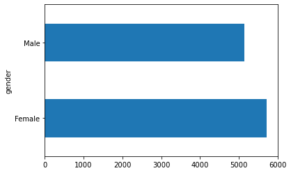


## 9. Convert Dataset Splits to TF Dataset


```python
# Convert dataset from Pandas dataframes to TF dataset 
batch_size = 128
diabetes_train_ds = df_to_dataset(d_train, PREDICTOR_FIELD, batch_size=batch_size)
diabetes_val_ds = df_to_dataset(d_val, PREDICTOR_FIELD, batch_size=batch_size)
diabetes_test_ds = df_to_dataset(d_test, PREDICTOR_FIELD, batch_size=batch_size)
```


```python
# We use this sample of the dataset to show transformations later
diabetes_batch = next(iter(diabetes_train_ds))[0]
def demo(feature_column, example_batch):
    feature_layer = layers.DenseFeatures(feature_column)
    print(feature_layer(example_batch))
```

## 10. Create Features
### Create Categorical Features with TF Feature Columns

Before we can create the TF categorical features, we must first create the vocab files with the unique values for a given field that are from the **training** dataset.


```python
# Build Vocabulary for Categorical Features
vocab_file_list = build_vocab_files(d_train, student_categorical_col_list)
```

### Create Categorical Features with Tensorflow Feature Column API


```python
from student_utils import create_tf_categorical_feature_cols
tf_cat_col_list = create_tf_categorical_feature_cols(student_categorical_col_list)
```

    INFO:tensorflow:vocabulary_size = 3 in change is inferred from the number of elements in the vocabulary_file ./diabetes_vocab/change_vocab.txt.


    INFO:tensorflow:vocabulary_size = 3 in change is inferred from the number of elements in the vocabulary_file ./diabetes_vocab/change_vocab.txt.


    INFO:tensorflow:vocabulary_size = 4 in readmitted is inferred from the number of elements in the vocabulary_file ./diabetes_vocab/readmitted_vocab.txt.


    INFO:tensorflow:vocabulary_size = 4 in readmitted is inferred from the number of elements in the vocabulary_file ./diabetes_vocab/readmitted_vocab.txt.


    INFO:tensorflow:vocabulary_size = 19 in payer_code is inferred from the number of elements in the vocabulary_file ./diabetes_vocab/payer_code_vocab.txt.


    INFO:tensorflow:vocabulary_size = 19 in payer_code is inferred from the number of elements in the vocabulary_file ./diabetes_vocab/payer_code_vocab.txt.


    INFO:tensorflow:vocabulary_size = 64 in medical_specialty is inferred from the number of elements in the vocabulary_file ./diabetes_vocab/medical_specialty_vocab.txt.


    INFO:tensorflow:vocabulary_size = 64 in medical_specialty is inferred from the number of elements in the vocabulary_file ./diabetes_vocab/medical_specialty_vocab.txt.


    INFO:tensorflow:vocabulary_size = 606 in primary_diagnosis_code is inferred from the number of elements in the vocabulary_file ./diabetes_vocab/primary_diagnosis_code_vocab.txt.


    INFO:tensorflow:vocabulary_size = 606 in primary_diagnosis_code is inferred from the number of elements in the vocabulary_file ./diabetes_vocab/primary_diagnosis_code_vocab.txt.


    INFO:tensorflow:vocabulary_size = 9586 in other_diagnosis_codes is inferred from the number of elements in the vocabulary_file ./diabetes_vocab/other_diagnosis_codes_vocab.txt.


    INFO:tensorflow:vocabulary_size = 9586 in other_diagnosis_codes is inferred from the number of elements in the vocabulary_file ./diabetes_vocab/other_diagnosis_codes_vocab.txt.


    INFO:tensorflow:vocabulary_size = 5 in max_glu_serum is inferred from the number of elements in the vocabulary_file ./diabetes_vocab/max_glu_serum_vocab.txt.


    INFO:tensorflow:vocabulary_size = 5 in max_glu_serum is inferred from the number of elements in the vocabulary_file ./diabetes_vocab/max_glu_serum_vocab.txt.


    INFO:tensorflow:vocabulary_size = 5 in A1Cresult is inferred from the number of elements in the vocabulary_file ./diabetes_vocab/A1Cresult_vocab.txt.


    INFO:tensorflow:vocabulary_size = 5 in A1Cresult is inferred from the number of elements in the vocabulary_file ./diabetes_vocab/A1Cresult_vocab.txt.


    INFO:tensorflow:vocabulary_size = 9 in admission_type_id is inferred from the number of elements in the vocabulary_file ./diabetes_vocab/admission_type_id_vocab.txt.


    INFO:tensorflow:vocabulary_size = 9 in admission_type_id is inferred from the number of elements in the vocabulary_file ./diabetes_vocab/admission_type_id_vocab.txt.


    INFO:tensorflow:vocabulary_size = 25 in discharge_disposition_id is inferred from the number of elements in the vocabulary_file ./diabetes_vocab/discharge_disposition_id_vocab.txt.


    INFO:tensorflow:vocabulary_size = 25 in discharge_disposition_id is inferred from the number of elements in the vocabulary_file ./diabetes_vocab/discharge_disposition_id_vocab.txt.


    INFO:tensorflow:vocabulary_size = 18 in admission_source_id is inferred from the number of elements in the vocabulary_file ./diabetes_vocab/admission_source_id_vocab.txt.


    INFO:tensorflow:vocabulary_size = 18 in admission_source_id is inferred from the number of elements in the vocabulary_file ./diabetes_vocab/admission_source_id_vocab.txt.


    INFO:tensorflow:vocabulary_size = 7 in race is inferred from the number of elements in the vocabulary_file ./diabetes_vocab/race_vocab.txt.


    INFO:tensorflow:vocabulary_size = 7 in race is inferred from the number of elements in the vocabulary_file ./diabetes_vocab/race_vocab.txt.


    INFO:tensorflow:vocabulary_size = 4 in gender is inferred from the number of elements in the vocabulary_file ./diabetes_vocab/gender_vocab.txt.


    INFO:tensorflow:vocabulary_size = 4 in gender is inferred from the number of elements in the vocabulary_file ./diabetes_vocab/gender_vocab.txt.


    INFO:tensorflow:vocabulary_size = 11 in age is inferred from the number of elements in the vocabulary_file ./diabetes_vocab/age_vocab.txt.


    INFO:tensorflow:vocabulary_size = 11 in age is inferred from the number of elements in the vocabulary_file ./diabetes_vocab/age_vocab.txt.


    INFO:tensorflow:vocabulary_size = 3 in Acarbose is inferred from the number of elements in the vocabulary_file ./diabetes_vocab/Acarbose_vocab.txt.


    INFO:tensorflow:vocabulary_size = 3 in Acarbose is inferred from the number of elements in the vocabulary_file ./diabetes_vocab/Acarbose_vocab.txt.


    INFO:tensorflow:vocabulary_size = 3 in Glimepiride is inferred from the number of elements in the vocabulary_file ./diabetes_vocab/Glimepiride_vocab.txt.


    INFO:tensorflow:vocabulary_size = 3 in Glimepiride is inferred from the number of elements in the vocabulary_file ./diabetes_vocab/Glimepiride_vocab.txt.


    INFO:tensorflow:vocabulary_size = 3 in Glipizide is inferred from the number of elements in the vocabulary_file ./diabetes_vocab/Glipizide_vocab.txt.


    INFO:tensorflow:vocabulary_size = 3 in Glipizide is inferred from the number of elements in the vocabulary_file ./diabetes_vocab/Glipizide_vocab.txt.


    INFO:tensorflow:vocabulary_size = 3 in Glipizide_And_Metformin_Hcl is inferred from the number of elements in the vocabulary_file ./diabetes_vocab/Glipizide_And_Metformin_Hcl_vocab.txt.


    INFO:tensorflow:vocabulary_size = 3 in Glipizide_And_Metformin_Hcl is inferred from the number of elements in the vocabulary_file ./diabetes_vocab/Glipizide_And_Metformin_Hcl_vocab.txt.


    INFO:tensorflow:vocabulary_size = 3 in Glipizide_And_Metformin_Hydrochloride is inferred from the number of elements in the vocabulary_file ./diabetes_vocab/Glipizide_And_Metformin_Hydrochloride_vocab.txt.


    INFO:tensorflow:vocabulary_size = 3 in Glipizide_And_Metformin_Hydrochloride is inferred from the number of elements in the vocabulary_file ./diabetes_vocab/Glipizide_And_Metformin_Hydrochloride_vocab.txt.


    INFO:tensorflow:vocabulary_size = 3 in Glyburide is inferred from the number of elements in the vocabulary_file ./diabetes_vocab/Glyburide_vocab.txt.


    INFO:tensorflow:vocabulary_size = 3 in Glyburide is inferred from the number of elements in the vocabulary_file ./diabetes_vocab/Glyburide_vocab.txt.


    INFO:tensorflow:vocabulary_size = 3 in Glyburide_And_Metformin_Hydrochloride is inferred from the number of elements in the vocabulary_file ./diabetes_vocab/Glyburide_And_Metformin_Hydrochloride_vocab.txt.


    INFO:tensorflow:vocabulary_size = 3 in Glyburide_And_Metformin_Hydrochloride is inferred from the number of elements in the vocabulary_file ./diabetes_vocab/Glyburide_And_Metformin_Hydrochloride_vocab.txt.


    INFO:tensorflow:vocabulary_size = 3 in Glyburide-metformin_Hydrochloride is inferred from the number of elements in the vocabulary_file ./diabetes_vocab/Glyburide-metformin_Hydrochloride_vocab.txt.


    INFO:tensorflow:vocabulary_size = 3 in Glyburide-metformin_Hydrochloride is inferred from the number of elements in the vocabulary_file ./diabetes_vocab/Glyburide-metformin_Hydrochloride_vocab.txt.


    INFO:tensorflow:vocabulary_size = 3 in Human_Insulin is inferred from the number of elements in the vocabulary_file ./diabetes_vocab/Human_Insulin_vocab.txt.


    INFO:tensorflow:vocabulary_size = 3 in Human_Insulin is inferred from the number of elements in the vocabulary_file ./diabetes_vocab/Human_Insulin_vocab.txt.


    INFO:tensorflow:vocabulary_size = 3 in Insulin_Human is inferred from the number of elements in the vocabulary_file ./diabetes_vocab/Insulin_Human_vocab.txt.


    INFO:tensorflow:vocabulary_size = 3 in Insulin_Human is inferred from the number of elements in the vocabulary_file ./diabetes_vocab/Insulin_Human_vocab.txt.


    INFO:tensorflow:vocabulary_size = 3 in Metformin_Hcl is inferred from the number of elements in the vocabulary_file ./diabetes_vocab/Metformin_Hcl_vocab.txt.


    INFO:tensorflow:vocabulary_size = 3 in Metformin_Hcl is inferred from the number of elements in the vocabulary_file ./diabetes_vocab/Metformin_Hcl_vocab.txt.


    INFO:tensorflow:vocabulary_size = 3 in Metformin_Hydrochloride is inferred from the number of elements in the vocabulary_file ./diabetes_vocab/Metformin_Hydrochloride_vocab.txt.


    INFO:tensorflow:vocabulary_size = 3 in Metformin_Hydrochloride is inferred from the number of elements in the vocabulary_file ./diabetes_vocab/Metformin_Hydrochloride_vocab.txt.


    INFO:tensorflow:vocabulary_size = 3 in Miglitol is inferred from the number of elements in the vocabulary_file ./diabetes_vocab/Miglitol_vocab.txt.


    INFO:tensorflow:vocabulary_size = 3 in Miglitol is inferred from the number of elements in the vocabulary_file ./diabetes_vocab/Miglitol_vocab.txt.


    INFO:tensorflow:vocabulary_size = 3 in Nateglinide is inferred from the number of elements in the vocabulary_file ./diabetes_vocab/Nateglinide_vocab.txt.


    INFO:tensorflow:vocabulary_size = 3 in Nateglinide is inferred from the number of elements in the vocabulary_file ./diabetes_vocab/Nateglinide_vocab.txt.


    INFO:tensorflow:vocabulary_size = 3 in Pioglitazone is inferred from the number of elements in the vocabulary_file ./diabetes_vocab/Pioglitazone_vocab.txt.


    INFO:tensorflow:vocabulary_size = 3 in Pioglitazone is inferred from the number of elements in the vocabulary_file ./diabetes_vocab/Pioglitazone_vocab.txt.


    INFO:tensorflow:vocabulary_size = 3 in Pioglitazone_Hydrochloride_And_Glimepiride is inferred from the number of elements in the vocabulary_file ./diabetes_vocab/Pioglitazone_Hydrochloride_And_Glimepiride_vocab.txt.


    INFO:tensorflow:vocabulary_size = 3 in Pioglitazone_Hydrochloride_And_Glimepiride is inferred from the number of elements in the vocabulary_file ./diabetes_vocab/Pioglitazone_Hydrochloride_And_Glimepiride_vocab.txt.


    INFO:tensorflow:vocabulary_size = 3 in Repaglinide is inferred from the number of elements in the vocabulary_file ./diabetes_vocab/Repaglinide_vocab.txt.


    INFO:tensorflow:vocabulary_size = 3 in Repaglinide is inferred from the number of elements in the vocabulary_file ./diabetes_vocab/Repaglinide_vocab.txt.


    INFO:tensorflow:vocabulary_size = 3 in Rosiglitazone_Maleate is inferred from the number of elements in the vocabulary_file ./diabetes_vocab/Rosiglitazone_Maleate_vocab.txt.


    INFO:tensorflow:vocabulary_size = 3 in Rosiglitazone_Maleate is inferred from the number of elements in the vocabulary_file ./diabetes_vocab/Rosiglitazone_Maleate_vocab.txt.


    INFO:tensorflow:vocabulary_size = 3 in Tolazamide is inferred from the number of elements in the vocabulary_file ./diabetes_vocab/Tolazamide_vocab.txt.


    INFO:tensorflow:vocabulary_size = 3 in Tolazamide is inferred from the number of elements in the vocabulary_file ./diabetes_vocab/Tolazamide_vocab.txt.


    INFO:tensorflow:vocabulary_size = 3 in Tolbutamide is inferred from the number of elements in the vocabulary_file ./diabetes_vocab/Tolbutamide_vocab.txt.


    INFO:tensorflow:vocabulary_size = 3 in Tolbutamide is inferred from the number of elements in the vocabulary_file ./diabetes_vocab/Tolbutamide_vocab.txt.


```python
test_cat_var1 = tf_cat_col_list[0]
print("Example categorical field:\n{}".format(test_cat_var1))
demo(test_cat_var1, diabetes_batch)
```

    Example categorical field:
    IndicatorColumn(categorical_column=VocabularyFileCategoricalColumn(key='change', vocabulary_file='./diabetes_vocab/change_vocab.txt', vocabulary_size=3, num_oov_buckets=0, dtype=tf.string, default_value=-1))
    tf.Tensor(
    [[0. 1. 0.]
     [0. 1. 0.]
     [0. 0. 1.]
     [0. 0. 1.]
     [0. 0. 1.]
     [0. 0. 1.]
     [0. 0. 1.]
     [0. 1. 0.]
     [0. 1. 0.]
     [0. 0. 1.]
     [0. 1. 0.]
     [0. 1. 0.]
     [0. 1. 0.]
     [0. 0. 1.]
     [0. 1. 0.]
     [0. 0. 1.]
     [0. 1. 0.]
     [0. 0. 1.]
     [0. 1. 0.]
     [0. 1. 0.]
     [0. 1. 0.]
     [0. 0. 1.]
     [0. 1. 0.]
     [0. 0. 1.]
     [0. 1. 0.]
     [0. 0. 1.]
     [0. 0. 1.]
     [0. 1. 0.]
     [0. 1. 0.]
     [0. 1. 0.]
     [0. 0. 1.]
     [0. 1. 0.]
     [0. 1. 0.]
     [0. 1. 0.]
     [0. 1. 0.]
     [0. 0. 1.]
     [0. 1. 0.]
     [0. 0. 1.]
     [0. 1. 0.]
     [0. 0. 1.]
     [0. 0. 1.]
     [0. 0. 1.]
     [0. 0. 1.]
     [0. 0. 1.]
     [0. 1. 0.]
     [0. 1. 0.]
     [0. 1. 0.]
     [0. 0. 1.]
     [0. 0. 1.]
     [0. 1. 0.]
     [0. 1. 0.]
     [0. 1. 0.]
     [0. 1. 0.]
     [0. 1. 0.]
     [0. 1. 0.]
     [0. 0. 1.]
     [0. 1. 0.]
     [0. 0. 1.]
     [0. 1. 0.]
     [0. 1. 0.]
     [0. 1. 0.]
     [0. 0. 1.]
     [0. 1. 0.]
     [0. 1. 0.]
     [0. 1. 0.]
     [0. 0. 1.]
     [0. 1. 0.]
     [0. 1. 0.]
     [0. 1. 0.]
     [0. 1. 0.]
     [0. 1. 0.]
     [0. 1. 0.]
     [0. 1. 0.]
     [0. 1. 0.]
     [0. 1. 0.]
     [0. 0. 1.]
     [0. 0. 1.]
     [0. 0. 1.]
     [0. 0. 1.]
     [0. 1. 0.]
     [0. 1. 0.]
     [0. 0. 1.]
     [0. 1. 0.]
     [0. 0. 1.]
     [0. 1. 0.]
     [0. 1. 0.]
     [0. 0. 1.]
     [0. 1. 0.]
     [0. 0. 1.]
     [0. 1. 0.]
     [0. 0. 1.]
     [0. 1. 0.]
     [0. 1. 0.]
     [0. 0. 1.]
     [0. 0. 1.]
     [0. 0. 1.]
     [0. 1. 0.]
     [0. 1. 0.]
     [0. 0. 1.]
     [0. 0. 1.]
     [0. 1. 0.]
     [0. 0. 1.]
     [0. 0. 1.]
     [0. 0. 1.]
     [0. 1. 0.]
     [0. 0. 1.]
     [0. 1. 0.]
     [0. 1. 0.]
     [0. 1. 0.]
     [0. 0. 1.]
     [0. 0. 1.]
     [0. 1. 0.]
     [0. 1. 0.]
     [0. 1. 0.]
     [0. 0. 1.]
     [0. 1. 0.]
     [0. 1. 0.]
     [0. 1. 0.]
     [0. 1. 0.]
     [0. 1. 0.]
     [0. 0. 1.]
     [0. 1. 0.]
     [0. 1. 0.]
     [0. 1. 0.]
     [0. 1. 0.]
     [0. 1. 0.]
     [0. 0. 1.]
     [0. 0. 1.]], shape=(128, 3), dtype=float32)


### Create Numerical Features with TF Feature Columns


```python
from student_utils import create_tf_numeric_feature
```


```python
def calculate_stats_from_train_data(df, col):
    mean = df[col].describe()['mean']
    std = df[col].describe()['std']
    return mean, std

def create_tf_numerical_feature_cols(numerical_col_list, train_df):
    tf_numeric_col_list = []
    for c in numerical_col_list:
        mean, std = calculate_stats_from_train_data(train_df, c)
        tf_numeric_feature = create_tf_numeric_feature(c, mean, std)
        tf_numeric_col_list.append(tf_numeric_feature)
    return tf_numeric_col_list
```


```python
tf_cont_col_list = create_tf_numerical_feature_cols(student_numerical_col_list, d_train)
```


```python
test_cont_var1 = tf_cont_col_list[0]
print("Example continuous field:\n{}\n".format(test_cont_var1))
demo(test_cont_var1, diabetes_batch)
```

    Example continuous field:
    NumericColumn(key='number_outpatient', shape=(1,), default_value=(0,), dtype=tf.float64, normalizer_fn=functools.partial(<function normalize_numeric_with_zscore at 0x7f529b6359e0>, mean=0.2950280993765931, std=1.0945794077577302))
    
    tf.Tensor(
    [[0.]
     [1.]
     [0.]
     [0.]
     [0.]
     [0.]
     [0.]
     [0.]
     [0.]
     [0.]
     [2.]
     [0.]
     [0.]
     [0.]
     [0.]
     [0.]
     [1.]
     [0.]
     [0.]
     [0.]
     [0.]
     [0.]
     [0.]
     [0.]
     [0.]
     [0.]
     [0.]
     [0.]
     [0.]
     [0.]
     [0.]
     [0.]
     [0.]
     [0.]
     [1.]
     [0.]
     [0.]
     [0.]
     [0.]
     [0.]
     [0.]
     [0.]
     [0.]
     [3.]
     [2.]
     [0.]
     [0.]
     [4.]
     [0.]
     [0.]
     [1.]
     [0.]
     [0.]
     [0.]
     [0.]
     [0.]
     [0.]
     [0.]
     [0.]
     [0.]
     [0.]
     [0.]
     [0.]
     [0.]
     [0.]
     [0.]
     [0.]
     [0.]
     [0.]
     [0.]
     [0.]
     [0.]
     [1.]
     [4.]
     [0.]
     [0.]
     [0.]
     [0.]
     [0.]
     [0.]
     [0.]
     [0.]
     [0.]
     [0.]
     [0.]
     [0.]
     [0.]
     [0.]
     [0.]
     [0.]
     [0.]
     [1.]
     [0.]
     [0.]
     [0.]
     [0.]
     [0.]
     [0.]
     [0.]
     [0.]
     [0.]
     [0.]
     [0.]
     [0.]
     [0.]
     [0.]
     [0.]
     [0.]
     [0.]
     [0.]
     [0.]
     [0.]
     [0.]
     [0.]
     [0.]
     [0.]
     [0.]
     [0.]
     [0.]
     [0.]
     [0.]
     [0.]
     [0.]
     [0.]
     [0.]
     [0.]
     [0.]
     [0.]], shape=(128, 1), dtype=float32)


## 11. Build Deep Learning Regression Model with Sequential API and TF Probability Layers

### Use DenseFeatures to combine features for model

Now that we have prepared categorical and numerical features using Tensorflow's Feature Column API, we can combine them into a dense vector representation for the model. Below we will create this new input layer, which we will call 'claim_feature_layer'.


```python
claim_feature_columns = tf_cat_col_list + tf_cont_col_list
claim_feature_layer = tf.keras.layers.DenseFeatures(claim_feature_columns)
```

### Build Sequential API Model from DenseFeatures and TF Probability Layers


```python
def build_sequential_model(feature_layer):
    model = tf.keras.Sequential([
        feature_layer,
        tf.keras.layers.Dense(150, activation='relu'),
        tf.keras.layers.Dense(200, activation='relu'),# New
        tf.keras.layers.Dense(75, activation='relu'),
        tfp.layers.DenseVariational(1+1, posterior_mean_field, prior_trainable),
        tfp.layers.DistributionLambda(
            lambda t:tfp.distributions.Normal(loc=t[..., :1],
                                             scale=1e-3 + tf.math.softplus(0.01 * t[...,1:])
                                             )
        ),
    ])
    return model

def build_diabetes_model(train_ds, val_ds,  feature_layer,  epochs=5, loss_metric='mse'):
    model = build_sequential_model(feature_layer)
    opt = tf.keras.optimizers.Adam(learning_rate=0.01)
    model.compile(optimizer=opt, loss=loss_metric, metrics=[loss_metric])
    #model.compile(optimizer='rmsprop', loss=loss_metric, metrics=[loss_metric])
    #early_stop = tf.keras.callbacks.EarlyStopping(monitor=loss_metric, patience=3)     
    history = model.fit(train_ds, validation_data=val_ds,
                        #callbacks=[early_stop],
                        epochs=epochs)
    return model, history 
```


```python
diabetes_model, history = build_diabetes_model(diabetes_train_ds, diabetes_val_ds,  claim_feature_layer,  epochs=10)
```

    Train for 255 steps, validate for 85 steps
    Epoch 1/10
    255/255 [==============================] - 12s 46ms/step - loss: 23.3398 - mse: 21.9805 - val_loss: 16.6591 - val_mse: 15.2821
    Epoch 2/10
    255/255 [==============================] - 7s 29ms/step - loss: 14.0923 - mse: 12.7151 - val_loss: 12.1025 - val_mse: 11.1008
    Epoch 3/10
    255/255 [==============================] - 7s 29ms/step - loss: 11.7516 - mse: 10.4729 - val_loss: 11.3418 - val_mse: 9.8243
    Epoch 4/10
    255/255 [==============================] - 7s 29ms/step - loss: 11.1177 - mse: 9.7876 - val_loss: 10.7256 - val_mse: 9.4355
    Epoch 5/10
    255/255 [==============================] - 7s 29ms/step - loss: 10.9138 - mse: 9.6560 - val_loss: 11.0735 - val_mse: 9.6851
    Epoch 6/10
    255/255 [==============================] - 7s 29ms/step - loss: 10.9784 - mse: 9.7231 - val_loss: 10.8895 - val_mse: 9.6570
    Epoch 7/10
    255/255 [==============================] - 7s 29ms/step - loss: 11.0472 - mse: 9.6741 - val_loss: 11.0071 - val_mse: 9.6353
    Epoch 8/10
    255/255 [==============================] - 7s 29ms/step - loss: 11.0732 - mse: 9.6119 - val_loss: 10.6469 - val_mse: 9.5497
    Epoch 9/10
    255/255 [==============================] - 7s 29ms/step - loss: 10.9500 - mse: 9.6645 - val_loss: 11.2855 - val_mse: 9.6241
    Epoch 10/10
    255/255 [==============================] - 8s 29ms/step - loss: 10.8509 - mse: 9.6483 - val_loss: 11.0490 - val_mse: 9.6274


### Show Model Uncertainty Range with TF Probability

Now that we have trained a model with TF Probability layers, we can extract the mean and standard deviation for each prediction. 


```python
feature_list = student_categorical_col_list + student_numerical_col_list
diabetes_x_tst = dict(d_test[feature_list])
diabetes_yhat = diabetes_model(diabetes_x_tst)
preds = diabetes_model.predict(diabetes_test_ds)
```


```python
from student_utils import get_mean_std_from_preds
m, s = get_mean_std_from_preds(diabetes_yhat)
```

### Show Prediction Output 


```python
prob_outputs = {
    "pred": preds.flatten(),
    "actual_value": d_test['time_in_hospital'].values,
    "pred_mean": m.numpy().flatten(),
    "pred_std": s.numpy().flatten()
}
prob_output_df = pd.DataFrame(prob_outputs)
```


```python
prob_output_df.head()
```


<div>
<table border="1" class="dataframe">
  <thead>
    <tr style="text-align: right;">
      <th></th>
      <th>pred</th>
      <th>actual_value</th>
      <th>pred_mean</th>
      <th>pred_std</th>
    </tr>
  </thead>
  <tbody>
    <tr>
      <th>0</th>
      <td>3.587955</td>
      <td>3.0</td>
      <td>4.673843</td>
      <td>0.693749</td>
    </tr>
    <tr>
      <th>1</th>
      <td>5.007016</td>
      <td>2.0</td>
      <td>4.673843</td>
      <td>0.693749</td>
    </tr>
    <tr>
      <th>2</th>
      <td>4.809363</td>
      <td>9.0</td>
      <td>4.673843</td>
      <td>0.693749</td>
    </tr>
    <tr>
      <th>3</th>
      <td>5.003417</td>
      <td>2.0</td>
      <td>4.673843</td>
      <td>0.693749</td>
    </tr>
    <tr>
      <th>4</th>
      <td>5.346958</td>
      <td>8.0</td>
      <td>4.673843</td>
      <td>0.693749</td>
    </tr>
  </tbody>
</table>
</div>


```python
prob_output_df.describe()
```


<div>
<table border="1" class="dataframe">
  <thead>
    <tr style="text-align: right;">
      <th></th>
      <th>pred</th>
      <th>actual_value</th>
      <th>pred_mean</th>
      <th>pred_std</th>
    </tr>
  </thead>
  <tbody>
    <tr>
      <th>count</th>
      <td>10854.000000</td>
      <td>10854.000000</td>
      <td>10854.000000</td>
      <td>10854.000000</td>
    </tr>
    <tr>
      <th>mean</th>
      <td>4.376980</td>
      <td>4.429888</td>
      <td>4.673843</td>
      <td>0.693749</td>
    </tr>
    <tr>
      <th>std</th>
      <td>0.908507</td>
      <td>3.002044</td>
      <td>0.000000</td>
      <td>0.000000</td>
    </tr>
    <tr>
      <th>min</th>
      <td>0.976290</td>
      <td>1.000000</td>
      <td>4.673843</td>
      <td>0.693749</td>
    </tr>
    <tr>
      <th>25%</th>
      <td>3.755292</td>
      <td>2.000000</td>
      <td>4.673843</td>
      <td>0.693749</td>
    </tr>
    <tr>
      <th>50%</th>
      <td>4.382993</td>
      <td>4.000000</td>
      <td>4.673843</td>
      <td>0.693749</td>
    </tr>
    <tr>
      <th>75%</th>
      <td>5.002859</td>
      <td>6.000000</td>
      <td>4.673843</td>
      <td>0.693749</td>
    </tr>
    <tr>
      <th>max</th>
      <td>7.529900</td>
      <td>14.000000</td>
      <td>4.673843</td>
      <td>0.693749</td>
    </tr>
  </tbody>
</table>
</div>


### Convert Regression Output to Classification Output for Patient Selection


```python
from student_utils import get_student_binary_prediction
student_binary_prediction = get_student_binary_prediction(prob_output_df, 'pred')
```


```python
student_binary_prediction.value_counts()
```


    0    8137
    1    2717
    Name: pred, dtype: int64


### Add Binary Prediction to Test Dataframe

Using the student_binary_prediction output that is a numpy array with binary labels, we can use this to add to a dataframe to better visualize and also to prepare the data for the Aequitas toolkit. The Aequitas toolkit requires that the predictions be mapped to a binary label for the predictions (called 'score' field) and the actual value (called 'label_value').


```python
def add_pred_to_test(test_df, pred_np, demo_col_list):
    for c in demo_col_list:
        test_df[c] = test_df[c].astype(str)
    test_df['score'] = pred_np
    test_df['label_value'] = test_df['time_in_hospital'].apply(lambda x: 1 if x >=5 else 0)
    return test_df

pred_test_df = add_pred_to_test(d_test, student_binary_prediction, ['race', 'gender'])
```


```python
pred_test_df[['patient_nbr', 'gender', 'race', 'time_in_hospital', 'score', 'label_value']].head()
```


<div>
<table border="1" class="dataframe">
  <thead>
    <tr style="text-align: right;">
      <th></th>
      <th>patient_nbr</th>
      <th>gender</th>
      <th>race</th>
      <th>time_in_hospital</th>
      <th>score</th>
      <th>label_value</th>
    </tr>
  </thead>
  <tbody>
    <tr>
      <th>0</th>
      <td>122896787</td>
      <td>Male</td>
      <td>Caucasian</td>
      <td>3.0</td>
      <td>0</td>
      <td>0</td>
    </tr>
    <tr>
      <th>1</th>
      <td>102598929</td>
      <td>Male</td>
      <td>Caucasian</td>
      <td>2.0</td>
      <td>1</td>
      <td>0</td>
    </tr>
    <tr>
      <th>2</th>
      <td>80367957</td>
      <td>Male</td>
      <td>Caucasian</td>
      <td>9.0</td>
      <td>0</td>
      <td>1</td>
    </tr>
    <tr>
      <th>3</th>
      <td>6721533</td>
      <td>Male</td>
      <td>Caucasian</td>
      <td>2.0</td>
      <td>1</td>
      <td>0</td>
    </tr>
    <tr>
      <th>4</th>
      <td>104346288</td>
      <td>Female</td>
      <td>Caucasian</td>
      <td>8.0</td>
      <td>1</td>
      <td>1</td>
    </tr>
  </tbody>
</table>
</div>


## 12. Model Evaluation Metrics 

Now it is time to use the newly created binary labels in the 'pred_test_df' dataframe to evaluate the model with some common classification metrics. We will create a report summary of the performance of the model and give the ROC AUC, F1 score(weighted), class precision and recall scores. 


```python
# AUC, F1, precision and recall
# Summary
y_true = pred_test_df['label_value'].values 
y_pred = pred_test_df['score'].values
```


```python
accuracy_score(y_true, y_pred)
```


    0.5627418463239359


```python
print(classification_report(y_true, y_pred))
```

                  precision    recall  f1-score   support
    
               0       0.62      0.75      0.68      6725
               1       0.39      0.25      0.31      4129
    
        accuracy                           0.56     10854
       macro avg       0.50      0.50      0.49     10854
    weighted avg       0.53      0.56      0.54     10854
    


```python
roc_auc_score(y_true, y_pred)
```


    0.5032089104088319


Precision-recall tradeoff - The model has been optimised to identify those patients correct for the trial with the fewest mistakes, while also trying to ensure we identify as many of them as possible.

Areas of imporovement - we could look to engineer new features that might help us better predict our target patients.


## 13. Evaluating Potential Model Biases with Aequitas Toolkit

### Prepare Data For Aequitas Bias Toolkit 

Using the gender and race fields, we will prepare the data for the Aequitas Toolkit.


```python
# Aequitas
from aequitas.preprocessing import preprocess_input_df
from aequitas.group import Group
from aequitas.plotting import Plot
from aequitas.bias import Bias
from aequitas.fairness import Fairness

ae_subset_df = pred_test_df[['race', 'gender', 'score', 'label_value']]
ae_df, _ = preprocess_input_df(ae_subset_df)
g = Group()
xtab, _ = g.get_crosstabs(ae_df)
absolute_metrics = g.list_absolute_metrics(xtab)
clean_xtab = xtab.fillna(-1)
aqp = Plot()
b = Bias()

```

    model_id, score_thresholds 1 {'rank_abs': [2717]}


```python
absolute_metrics = g.list_absolute_metrics(xtab)
xtab[[col for col in xtab.columns if col not in absolute_metrics]]
```


<div>
<table border="1" class="dataframe">
  <thead>
    <tr style="text-align: right;">
      <th></th>
      <th>model_id</th>
      <th>score_threshold</th>
      <th>k</th>
      <th>attribute_name</th>
      <th>attribute_value</th>
      <th>pp</th>
      <th>pn</th>
      <th>fp</th>
      <th>fn</th>
      <th>tn</th>
      <th>tp</th>
      <th>group_label_pos</th>
      <th>group_label_neg</th>
      <th>group_size</th>
      <th>total_entities</th>
    </tr>
  </thead>
  <tbody>
    <tr>
      <th>0</th>
      <td>1</td>
      <td>binary 0/1</td>
      <td>2717</td>
      <td>race</td>
      <td>?</td>
      <td>86</td>
      <td>240</td>
      <td>56</td>
      <td>85</td>
      <td>155</td>
      <td>30</td>
      <td>115</td>
      <td>211</td>
      <td>326</td>
      <td>10854</td>
    </tr>
    <tr>
      <th>1</th>
      <td>1</td>
      <td>binary 0/1</td>
      <td>2717</td>
      <td>race</td>
      <td>AfricanAmerican</td>
      <td>491</td>
      <td>1530</td>
      <td>291</td>
      <td>592</td>
      <td>938</td>
      <td>200</td>
      <td>792</td>
      <td>1229</td>
      <td>2021</td>
      <td>10854</td>
    </tr>
    <tr>
      <th>2</th>
      <td>1</td>
      <td>binary 0/1</td>
      <td>2717</td>
      <td>race</td>
      <td>Asian</td>
      <td>15</td>
      <td>60</td>
      <td>10</td>
      <td>16</td>
      <td>44</td>
      <td>5</td>
      <td>21</td>
      <td>54</td>
      <td>75</td>
      <td>10854</td>
    </tr>
    <tr>
      <th>3</th>
      <td>1</td>
      <td>binary 0/1</td>
      <td>2717</td>
      <td>race</td>
      <td>Caucasian</td>
      <td>2030</td>
      <td>6038</td>
      <td>1249</td>
      <td>2298</td>
      <td>3740</td>
      <td>781</td>
      <td>3079</td>
      <td>4989</td>
      <td>8068</td>
      <td>10854</td>
    </tr>
    <tr>
      <th>4</th>
      <td>1</td>
      <td>binary 0/1</td>
      <td>2717</td>
      <td>race</td>
      <td>Hispanic</td>
      <td>52</td>
      <td>141</td>
      <td>35</td>
      <td>48</td>
      <td>93</td>
      <td>17</td>
      <td>65</td>
      <td>128</td>
      <td>193</td>
      <td>10854</td>
    </tr>
    <tr>
      <th>5</th>
      <td>1</td>
      <td>binary 0/1</td>
      <td>2717</td>
      <td>race</td>
      <td>Other</td>
      <td>43</td>
      <td>128</td>
      <td>26</td>
      <td>40</td>
      <td>88</td>
      <td>17</td>
      <td>57</td>
      <td>114</td>
      <td>171</td>
      <td>10854</td>
    </tr>
    <tr>
      <th>6</th>
      <td>1</td>
      <td>binary 0/1</td>
      <td>2717</td>
      <td>gender</td>
      <td>Female</td>
      <td>1413</td>
      <td>4306</td>
      <td>820</td>
      <td>1675</td>
      <td>2631</td>
      <td>593</td>
      <td>2268</td>
      <td>3451</td>
      <td>5719</td>
      <td>10854</td>
    </tr>
    <tr>
      <th>7</th>
      <td>1</td>
      <td>binary 0/1</td>
      <td>2717</td>
      <td>gender</td>
      <td>Male</td>
      <td>1304</td>
      <td>3831</td>
      <td>847</td>
      <td>1404</td>
      <td>2427</td>
      <td>457</td>
      <td>1861</td>
      <td>3274</td>
      <td>5135</td>
      <td>10854</td>
    </tr>
  </tbody>
</table>
</div>


### Reference Group Selection


```python
# Test reference group with Caucasian Male
bdf = b.get_disparity_predefined_groups(clean_xtab, 
                    original_df=ae_df, 
                    ref_groups_dict={'race':'Caucasian', 'gender':'Male'
                                     }, 
                    alpha=0.05, 
                    check_significance=False)


f = Fairness()
fdf = f.get_group_value_fairness(bdf)
```

    get_disparity_predefined_group()


### Race and Gender Bias Analysis for Patient Selection


```python
# Plot two metrics
# Is there significant bias in your model for either race or gender?
fpr_disparity1 = aqp.plot_disparity(bdf, group_metric='fpr_disparity', attribute_name='race')
```


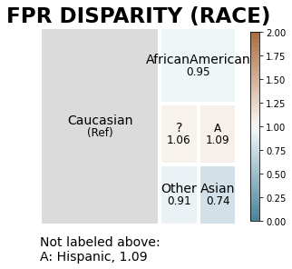


We notice that while with most races, there is no significant indication of bias, there is an indication that Asians are less likely to be itentified by the model, based on the 0.4 disparity in relation to the Caucasian reference group.


```python
fpr_disparity2 = aqp.plot_disparity(bdf, group_metric='fpr_disparity', attribute_name='gender')
```


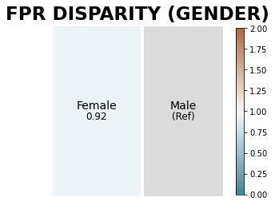


With gender, there does not seem to be any significant indication of bias.

### Fairness Analysis Example - Relative to a Reference Group 


```python
# Reference group fairness plot
fpr_fairness = aqp.plot_fairness_group(fdf, group_metric='fpr', title=True)
```


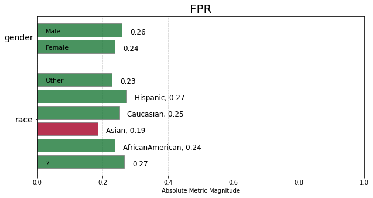


Here again we can see that there appears to be signficant disparity with the Asian race being under-represented with a magnitude of 0.19.
